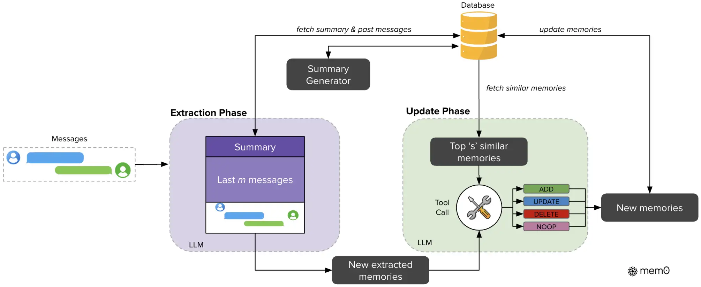
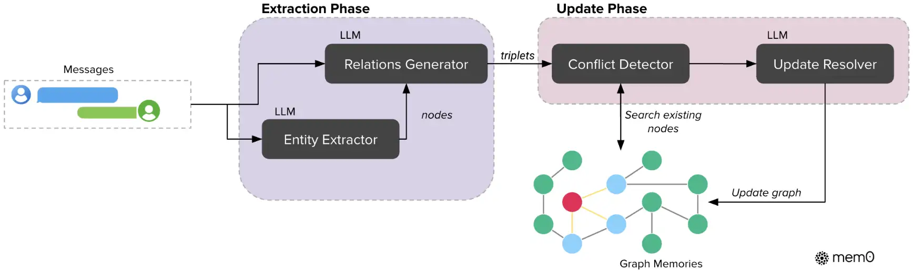

参考视频：[工业界都是如何实现agent memory的：mem0【代码精读】](https://www.bilibili.com/video/BV1v8PYz1EUt)

# Mem0

## 系统1：基于语义的记忆系统（类似RAG）

1. 当前轮次消息${m_{t-1},m_t}$
2. 消息前面拼上“对话摘要+最近m条消息”，得到带上下文的新消息$P=(S,\{m_{t-m},...,m_{t-2}\},m_{t-1},m_{t})$
3. LLM提取出n条记忆$\mathrm{\Omega}=\{\mathrm{\omega}_1,\mathrm{\omega}_2,...,\mathrm{\omega}_\mathrm{n}\}$
4. 对于提取出的每条记忆，从向量数据库中检索出top $s$条相似的现有记忆，一起喂给LLM进行比对
5. LLM调用工具，完成对记忆的增删改查，更新记忆数据库

其中summary是由一个LLM异步地做增量更新得到的当前对话的summary。

从图中可以看出，它的Database里至少存储了三样东西：原始对话历史、对话的滚动 Summary，以及经过 Extraction 和 ADD/UPDATE/DELETE/NOOP 后形成的原子记忆。

## 系统2：基于图的记忆系统（Mem0 Graph）

当前轮次消息→用LLM提取entity和relation得到三元组→冲突检测→LLM解析器来更新图记忆

得到的记忆图是$G = (V, E, L)$ ，其中，$V$是entity，$E$是edge，$L$是label（分配给节点的语义类型）。
