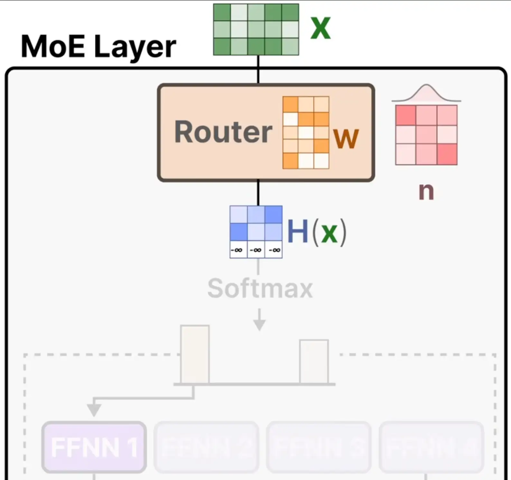

参考视频：[A Visual Guide to Mixture of Experts (MoE) in LLMs](https://www.youtube.com/watch?v=sOPDGQjFcuM)

MoE的结构图如下所示：

# 结构讲解

MoE架构的LLM，其实就是把Dense Model里Attention后面的FFN换成MoE层。MoE层有两部分：Router和Exports，Router=Linear + Top-k gating + Softmax，Exports就是很多个FFN。

Router被训练用来给token选top-k个专家，这里的k是个超参数，表示激活的专家数。训练/推理的时候，如果忽略batch_size，输入$X$是[seq_len, hidden_size]维度，Router中的线性层$W$是[exports_num, hidden_size]维度，计算出logits值$H(X)=XW^{\top}$（是[seq_len, exports_num]维度）。

记总专家数为n，激活专家数为k，则对于$H(X)$的每行（对应一个token），取最大的前k个值保留不变，剩下的n-k个数全部赋值为-inf，然后计算softmax，得到n个专家的权重值$p_i\ (0\le i\lt n)$。这里的$p_i$就是这个token在专家$i$上的权重，其中只有top-k专家的$p_i$大于0，其他专家的$p_i$等于0。

然后，被选中的k个专家将输入$X$，得到$\text{FFN}_i(X)$。最终，整个MoE层的输出是：
$$
\text{MoE}(X)=\sum_{i=0}^{n-1}{p_i*\text{FFN}_i(X)}
$$
注：实际计算时，只有top-k专家需要计算对应的$\text{FFN}_i(X)$。

# 负载均衡

在 MoE 里，router 会学习把 token 分配给不同专家。每个专家的初始化不同，如果没有约束，router会把大多数token长期路由到少数几个loss更容易降低的专家，而其他专家几乎得不到训练信号。这会导致模型容量被浪费，退化为少数专家组成的 dense FFN。因此，我们需要负载均衡。

本文讲三种最常见的负载均衡方法：Auxiliary Loss、Capacity Limit、Noisy routing。

## Auxiliary Loss

对于专家$i$，每个token在route后得到它在这个专家的权重值$p_i$。取一个batch，把里面所有token的$p_i$计算出来，求和，得到专家$i$的重要性$I_i$。Auxiliary Loss的思想是，n个专家的$I_i$分布越不平均，说明负载越不均衡，需要惩罚它，给它加个loss。

负载的“不均衡度”可以用Coefficient Variation (CV)来表示：
$$
CV(\mathbf{I})=\frac{\sigma(\mathbf{I})}{\mu(\mathbf{I})}
$$
其中$\mathbf{I} = [I_0, I_1, ... , I_{n-1}]$，$\sigma(\mathbf{I})$是标准差，$\mu(\mathbf{I})$是均值。然后辅助损失Auxiliary Loss为：
$$
\text{Auxiliary\_Loss}=\lambda*CV^2(\mathbf{I})
$$
其中$\lambda$是常数缩放因子。

## Capacity Limit

强制要求每个 expert 每个 batch 只能接收有限 token，定义每个专家在每个batch能接收的总token数为：
$$
\text{capacity}=\left\lceil\frac{tokens}{experts}\cdot capacity\_factor\right\rceil
$$
如果route的时候发现选定专家在这个batch里接收的token数已经达到capacity了，那就两种策略二选一：

- Drop：直接丢掉这个 token
- Re-route：改分配给次优 expert

## Noisy Routing

训练的时候，给router的logits值$H(X)=XW^{\top}$加上一个高斯噪声，变成$H'(X)=XW^{\top}+\sigma\cdot\mathrm{noise}$，这样就能更随机地探索 expert，让更多专家被训练到。推理时去掉噪声，更精准地选择专家。
